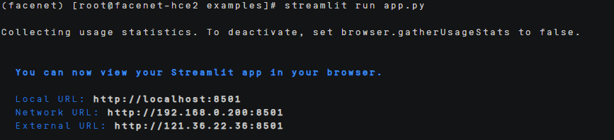

# FaceNet部署指南


## ‌一、环境准备


### 更新系统


#### EulerOS2.0


```
yum -y update  
yum -y upgrade
```


#### Ubuntu 24.04


```
apt-get -y update
export DEBIAN_FRONTEND=noninteractive
apt-get -y -o Dpkg::Options::="--force-confold" dist-upgrade
```


## **二、安装conda**


```
mkdir -p ~/miniconda3

wget https://repo.anaconda.com/miniconda/Miniconda3-latest-Linux-aarch64.sh -O ~/miniconda3/miniconda.sh

bash ~/miniconda3/miniconda.sh -b -u -p ~/miniconda3

rm -f ~/miniconda3/miniconda.sh

source ~/miniconda3/bin/activate

conda init --all
```


创建虚拟环境

```
conda create -n facenet python=3.9
```

## **三、源码下载**

### **1.下载FaceNet的源码**

```
git clone https://github.com/timesler/facenet-pytorch.git

安装依赖：

pip install facenet-pytorch -i https://pypi.tuna.tsinghua.edu.cn/simple

pip install cloudpickle ml-dtypes scipy pandas -i https://pypi.tuna.tsinghua.edu.cn/simple

pip install pyyaml decorator attrs psutil -i https://pypi.tuna.tsinghua.edu.cn/simple

\#追踪需要安装mmcv

pip install mmcv -i https://pypi.tuna.tsinghua.edu.cn/simple

pip install ipython -i https://pypi.tuna.tsinghua.edu.cn/simple

pip install streamlit -i https://pypi.tuna.tsinghua.edu.cn/simple

conda install -c conda-forge ffmpeg
```

### **2.代码修改**

新建[app.py](../scripts/app.py)


## **四、启动项目**

可视化界面推理：

streamlit run app.py

 

 运行之后出现这个界面，然后使用IP+8501进行网页进行视频人脸检测。

 

 

